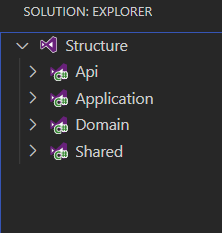

# Umbraco and CQRS

### 0. About

CQRS/CQS is one of my favorite architectural patterns. Especially in the combination with DDD (Domain Driven Design).

Some time ago, we’ve had an idea to create a sample project using Umbraco with CQRS. We created a sample Umbraco v9 application and focused on the Members domain for the example purposes. Our goal was to apply the Clean Architecture concept onto it and implement the base for the future Clean-Umbraco-CQRS projects. Today I want to share and explain these concepts and code with you all.

### 1. Clean Architecture

Clean Architecture is an architectural style concept that can be defined as a set of guidelines for systems that strictly fallows the principle of separation of concerns. The main goal is to create / divide the application into specific, responsible, simple, extensible layers.


 > Clean Architecture diagram. Taken from [clean coder blog](https://blog.cleancoder.com/uncle-bob/2012/08/13/the-clean-architecture.html).

As it's seen in the picture, it is a layered architecture that puts the domain as an entrance to the designed system - the each inner layer does not depend on the outer layer.

This architectural style evolves or has similar concepts such as:
 * Hexagonal Architecture

<p align="center">
 
</p>

 > Hexagonal Architecture scheme. Taken from [clean coder blog](https://blog.cleancoder.com/uncle-bob/2012/08/13/the-clean-architecture.html).

 * Ports and Adapters

<p align="center">
 
</p>

 > Ports and Adapter architecture scheme. Taken from [idealo-tech-blog](https://medium.com/idealo-tech-blog/hexagonal-ports-adapters-architecture-e3617bcf00a0).

 * Onion Architecture

<p align="center">
 
</p>

You can read more about it on [Uncle Bob's](https://blog.cleancoder.com/uncle-bob/2012/08/13/the-clean-architecture.html) article.

For the application layer and solution itself, there are a few technics to organize its structure. The most common are:

 1) In the first structure example, the 'Application' layer contains all of the business rules, infrastructure aspects, repositories, services etc. and only domain entities and shared code is extracted to the separated projects:



 2) In this example, structure has the 'Core' project that contains all of the above described and the domain entities - all bundled together:


 3) Last, but not least, we can have a separation of responsibilities to dedicated layers for domain entities, application rules, domain logic, infrastructural configuration and so on:


 > **Note:** Sometimes the 'Application' layer is also called 'Core'

 > **Note:** Sometimes the 'Shared' layer is also called 'SharedKernel'

### 2. CQRS / CQS

[CQRS](https://martinfowler.com/bliki/CQRS.html) is an architectural pattern and is usally applied on the top of the application layer. It's based on CQS principle. In short, **C**ommand **Q**uery **R**esponsibility **S**egregation stands for separating commands as writes and queries as reads in regards to the storage within the application.


[CQS](https://martinfowler.com/bliki/CommandQuerySeparation.html) is a design principle that is based on applying the separation of concerns in our applications. In short, **C**ommand **Q**uery **S**eparation stand behind idea:

> Every method should either be a command that performs an action, or a query that returns data to the caller, but not both.

You can read more information about CQRS/CQS by visitng the external resources listed in the [reference](#5) section on the bottom of the article.

Let's focus on more technical solution of CQRS!

##### 2.1. Command + Handler + Dispatcher

**Commands** are used to modify state. A good example is the command to `RegisterMember`. It contains all the needed details on processing this command by Command Handler.

Bellow you can see the markup / abstraction for a proper command model. **Command doesn't return any value.**

```csharp
public interface ICommand
{
}
```

**Command Handler** is used to process dedicated command. As you can see, generic _TCommand_ is there for letting know `Command Dispatcher` what exact implementation of `Command Handler` we need to get (it's mostly for DI to let know about dedicated implementation) and then to send a dedicated command object as strongly type object further.

```csharp
public interface ICommandHandler<in TCommand> where TCommand : class, ICommand
{
    ValueTask HandleAsync(TCommand command);
}
```

**Command Dispatcher** - "is an object that links the Action-Request with the appropriate Action-Handler". I can't describe it better, so let's see it in the implementation:

``` csharp
public interface ICommandDispatcher
{
    ValueTask DispatchAsync<TCommand>(TCommand command) where TCommand : class, ICommand;
}
```

Then, we can extend it and implement for example the 'in memory' implementation of it:

```csharp
public class InMemoryCommandDispatcher : ICommandDispatcher
{
    private readonly IDependencyResolver _dependencyResolver;

    public InMemoryCommandDispatcher(IDependencyResolver dependencyResolver)
        => _dependencyResolver = dependencyResolver;

    public async ValueTask DispatchAsync<TCommand>(TCommand command)
        where TCommand : class, ICommand
    {
        try
        {
            var handler = _dependencyResolver.Resolve<ICommandHandler<TCommand>>();

            await handler.HandleAsync(command);
        }
        catch (DependencyNotFoundException dependencyNotFoundException)
        {
            throw new CommandHandlerNotFoundException(
                $"Command handler for {typeof(TCommand).Name} not found.",
                dependencyNotFoundException);
        }
        catch (Exception)
        {
            throw;
        }
    }
}
```

##### 2.2. Query + Query Handler

**Queries** are used to read the state of a dedicated domain object. **They are not changing state of the systems.**

The markup / abstraction for the dedicated query may look like this:

```csharp
public interface IQuery<in TQuery, out TResult> where TQuery : class
{
}
```

Where _TQuery_ is a strongly typed definition of the query f.e. `GetMemberByEmail` and _TResult_ is any kind of the result type (it can be a DTO, list of DTOs, etc.).

**Query Handler** - is used to process the dedicated query. As you can see TQuery is there to let know our `Query Dispatcher` what exact implementation of `Query Handler` we need to get (it's mostly for DI to let know about dedicated implementation) and to send a dedicated query object as a strongly type object with `TResult` return type.

```csharp
public interface IQueryHandler<in TQuery, TResult> where TQuery : class, IQuery<TQuery, TResult>
{
    ValueTask<TResult> HandleAsync(TQuery query);
}
```

**Query Dispatcher** - same as `Command Handler` - is used to get a proper query handler and dispatch it. It can be also a wrapper to wrap exceptions, what is a common use-case of them.

``` csharp
public interface IQueryDispatcher
{
    ValueTask<TResult> QueryAsync<TQuery, TResult>(IQuery<TQuery, TResult> query)
        where TQuery : class, IQuery<TQuery, TResult>;
}
```

Below code example shows the 'in memory' implementation of the Query Dispatcher:

```csharp
public class InMemoryQueryDispatcher : IQueryDispatcher
{
    private readonly IDependencyResolver _dependencyResolver;

    public InMemoryQueryDispatcher(IDependencyResolver dependencyResolver)
        => _dependencyResolver = dependencyResolver;

    public async ValueTask<TResult> QueryAsync<TQuery, TResult>(IQuery<TQuery, TResult> query)
        where TQuery : class, IQuery<TQuery, TResult>
    {
        try
        {
            var handler = _dependencyResolver.Resolve<IQueryHandler<TQuery, TResult>>();

            return await handler.HandleAsync((TQuery)query);
        }
        catch (DependencyNotFoundException dependencyNotFoundException)
        {
            throw new QueryHandlerNotFoundException(
                $"Query handler for {typeof(TQuery).Name} not found.",
                dependencyNotFoundException);
        }
        catch (Exception)
        {
            throw;
        }
    }
}
```

##### 2.3. Aggregate, Value Objects, DTO, POCO

What it is? In short:
 * **Aggregate** - a single and simple domain object with the identity and domain operations on it (that aggregates it all together).
 * **Value Object** - similar to Aggregate, but without the identity. When we compare Value Objects, only if all properties match each other, it means that those are the same objects (each value needs to be the same, no need to have any identity to make them equal).
 * **DTO** - data object without any logic in it.

Aggregate, Value Objects, DTO, POCO are a very large topic and are for the explorations. If you'd want to explore more about them, check out some of the below materials that describes them in more details:
 * https://martinfowler.com/bliki/DDD_Aggregate.html
 * https://enterprisecraftsmanship.com/posts/entity-vs-value-object-the-ultimate-list-of-differences/
 * https://enterprisecraftsmanship.com/posts/dto-vs-value-object-vs-poco/

### 3. Example details

Let's begin with a diagram about our domain example for Member registration and management.


We designed layers and its dependencies there. Like on Onion Architecture concept, you can see that **Domain layer does not know anything about any other layers**. Application layer knows only about the Domain and Infrastructure knows all about Application and Domain. Shared project is used for abstractions or shared implementation (can be used in modules with same architecture).

Lets focus on two examples for the simplicity:
 * **Member registration** - to explore how we can create commands
 * **Getting member by email** - to explore how we can query data

Lets start from the entry point of our Application - _Startup.cs_:

```csharp
private void RegisterUmbracoDependencies([NotNull] IServiceCollection services)
    => services
        .AddUmbraco(_env, _config)
        .AddBackOffice()
        .AddWebsite()
        .AddComposers()
        .AddApplication()
        .AddInfrastructure()
        .Build();
```

We are registering the application and infrastructure layers to our DI. Those are extensions method that perform registration inside a proper dependencies.

```csharp
public static class ApplicationExtensions
{
    public static IUmbracoBuilder AddApplication([NotNull] this IUmbracoBuilder umbracoBuilder)
    {
        _ = umbracoBuilder.Services
            .AddApplication();

        return umbracoBuilder;
    }

    public static IServiceCollection AddApplication(this IServiceCollection serviceCollection)
        => serviceCollection.AddCommands();
}
```

```csharp
public static class InfrastructureExtensions
{
    public static IUmbracoBuilder AddInfrastructure([NotNull] this IUmbracoBuilder umbracoBuilder)
    {
        _ = umbracoBuilder.Services
            .AddInfrastructure();

        return umbracoBuilder
            .AddUmbracoHandlers();
    }

    public static IServiceCollection AddInfrastructure(this IServiceCollection serviceCollection)
        => serviceCollection
            .AddQueries()
            .AddCommandDispatcher()
            .AddQueryDispatcher()
            .AddCommandHandlersLogging()
            .AddServices();
}
```
> **Note:** `AddQueries`, `AddCommands`, `AddCommandDispatcher`, `AddQueryDispatcher` those are extension methods that are using [Scrutor](https://github.com/khellang/Scrutor) to find implementation based on the abstraction on invoked assembly and automatically register it in the DI.

 1. Members registration

  WIn the app, we have a form that is calling the action controller to perform form submit. This surface controller looks like this:

  ```csharp
    public class RegistrationSurfaceController : SurfaceController
    {
        private readonly ICommandDispatcher _commandDispatcher;
        private readonly Lazy<IUmbracoContentNodeService> _umbracoContentNodeService;

        public RegistrationSurfaceController(IUmbracoContextAccessor umbracoContextAccessor,
            IUmbracoDatabaseFactory databaseFactory,
            ServiceContext services,
            AppCaches appCaches,
            IProfilingLogger profilingLogger,
            IPublishedUrlProvider publishedUrlProvider,
            ICommandDispatcher commandDispatcher,
            Lazy<IUmbracoContentNodeService> umbracoContentNodeService)
            : base(umbracoContextAccessor, databaseFactory, services, appCaches, profilingLogger, publishedUrlProvider)
        {
            _commandDispatcher = commandDispatcher;
            _umbracoContentNodeService = umbracoContentNodeService;
        }

        [HttpPost]
        [ValidateAntiForgeryToken]
        public async ValueTask<IActionResult> Register(RegisterMember command)
        {
            if (!ModelState.IsValid)
            {
                return CurrentUmbracoPage();
            }

            try
            {
                await _commandDispatcher.DispatchAsync(command);
            }
            catch (System.Exception exception)
            {
                switch (exception)
                {
                    case MemberAlreadyExistsException memberAlreadyExistsException:
                        {
                            ModelState.AddModelError(memberAlreadyExistsException.Code, "Bad username or password");
                        }
                        break;

                    case PasswordEmptyException passwordEmptyException:
                        {
                            ModelState.AddModelError(passwordEmptyException.Code, "Empty password");
                        }
                        break;

                    case PasswordNotMatchConfirmationException passwordNotMatchConfirmationException:
                        {
                            ModelState.AddModelError(passwordNotMatchConfirmationException.Code, "Passwords not match.");
                        }
                        break;

                    default:
                        throw;
                }

                return CurrentUmbracoPage();
            }

            var homePage = _umbracoContentNodeService.Value.GetHomePage();

            return Redirect(homePage is not null
                ? homePage.Url(mode: UrlMode.Relative)
                : "/");
        }
    }
  ```

  In it, we are mapping the request model to our `RegisterMember` command object and then perform the execution for this command.

  What we are doing in `Command Handler` is:

  ```csharp
    internal class RegisterMemberHandler : ICommandHandler<RegisterMember>
    {
        private readonly IMemberManager _memberManager;
        private readonly IMemberService _memberService;

        public RegisterMemberHandler(IMemberManager memberManager, IMemberService memberService)
        {
            _memberManager = memberManager;
            _memberService = memberService;
        }

        public async ValueTask HandleAsync(RegisterMember command)
        {
            var existingMember = _memberService.GetByEmail(command.Email);

            if (existingMember is not null)
            {
                throw new MemberAlreadyExistsException(command.Email);
            }

            if (string.IsNullOrWhiteSpace(command.Password) || string.IsNullOrWhiteSpace(command.PasswordConfirmation))
            {
                throw new PasswordEmptyException();
            }

            if (!command.Password.Equals(command.PasswordConfirmation))
            {
                throw new PasswordNotMatchConfirmationException();
            }

            var member = _memberService.CreateWithIdentity(
                command.Email,
                command.Email,
                command.Password,
                Member.ModelTypeAlias);

            _memberService.Save(member);
        }
    }
  ```

  Now, there are a few approaches to validate command data:
   * inside command handler
   * via attributes - not that 'clean'
   * by [Fluent Validation](https://docs.fluentvalidation.net/en/latest/aspnet.html#using-the-validator-in-a-controller) and the request model binding - it's a very clean way to do that what I highly recommend following!

  As we can see in the code, we are throwing application layer exception if validation is not met. Clever!

  If all is ok, we are simply registering the member.

 2. Getting member by email from the API controller

 Let's now see how we can perform the query operation. For that let's use a little bit different approach with Web API application.

 This is how our API controller looks like:

 ```csharp
    [Route("api/[controller]")]
    [ApiController]
    public class MemberController : ControllerBase
    {
        private readonly IQueryDispatcher _queryDispatcher;

        public MemberController(IQueryDispatcher queryDispatcher)
            => _queryDispatcher = queryDispatcher;

        public ActionResult<TResult> OkOrNotFound<TResult>(TResult result)
            => result is not null
                ? Ok(result)
                : NotFound();

        [HttpGet("{email}")]
        public async ValueTask<ActionResult<string>> Get([FromRoute] GetMemberByEmail query)
        {
            var member = await _queryDispatcher.QueryAsync(query);

            return OkOrNotFound(member?.Name ?? "Error");
        }
    }
  ```

 The route for it is `site/api/member/{email}` - here instead the `{email}` placeholder, we'll put a valid email address that will be binded into `GetMemberByEmail` query object visible below:

  ```csharp
    public record GetMemberByEmail(string Email) : IQuery<GetMemberByEmail, IMember>;
  ```

  After that, we are processing a query via the handler to get a proper query response model:

  ```csharp
    internal class GetMemberByEmailHandler : IQueryHandler<GetMemberByEmail, IMember>
    {
        private readonly IMemberService _memberService;

        public GetMemberByEmailHandler(IMemberService memberService)
            => _memberService = memberService;

        public ValueTask<IMember> HandleAsync(GetMemberByEmail query)
        {
            var member = _memberService.GetByEmail(query.Email);

            return ValueTask.FromResult(member);
        }
    }
  ```

  > **Note:** We could perform the mapping to DTO object, but for simplicity we are returning the Umbraco member definition.

Voila!

### 4. Summary

Hope this example shows ideally how simple and effective (in terms of its scalability and maintainability) this architecture style can be. As every other, it has its pros and cons and is not always a good choice to introduce it (for example when we only need to display content - it could be over-engineering and overkill).

By applying CQS/CQRS and Clean Architecture concept, our code gained more readability, layer responsibility and standardized style. It can be seen as more complex to initially understand and introduce to the first project as setting it up imposes an effort on creating abstractions, commands, queries and keeping domain clear.

But from the other perspective, especially for the complex solutions and large teams, it can speed up the delivery process drastically - due to its need for standardization and universal patterns within it. Specific boost is possible to be captured with a combination with Event Storming sessions, where after the domain explorations and transforming it from the events cards and client's needs into software, is possible on a very early stage, even during the workshop and using a human language for it. Implementation then really become a details in the end.

If you have any thoughts, doubts, concerns or maybe some experience with any of the above described patterns, reach out to me know on Twitter and let me know what do you think about it, how are you using it etc.

Cheers! Happy coding :)

### 5. References:
 * https://martinfowler.com/bliki/CQRS.html
 * https://cqrs.files.wordpress.com/2010/11/cqrs_documents.pdf
 * https://blog.jacobsdata.com/2020/02/19/a-brief-intro-to-clean-architecture-clean-ddd-and-cqrs
 * https://danylomeister.blog/2020/06/25/cqs-cqrs-event-sourcing-whats-the-difference
 * DevMentors mini course about Clean Architecture and Modular Monolith: https://www.youtube.com/watch?v=NzcZcim9tp8 + https://www.youtube.com/watch?v=MkdutzVB3pY
